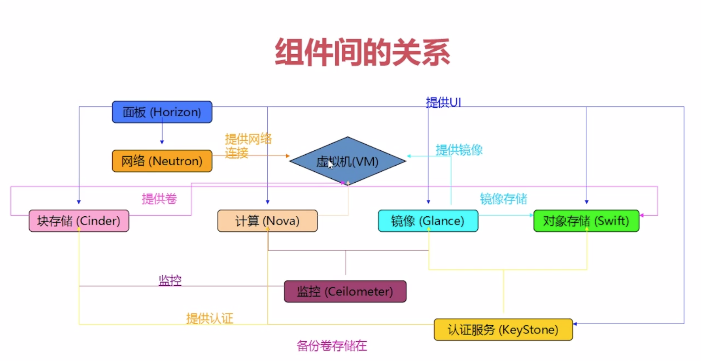
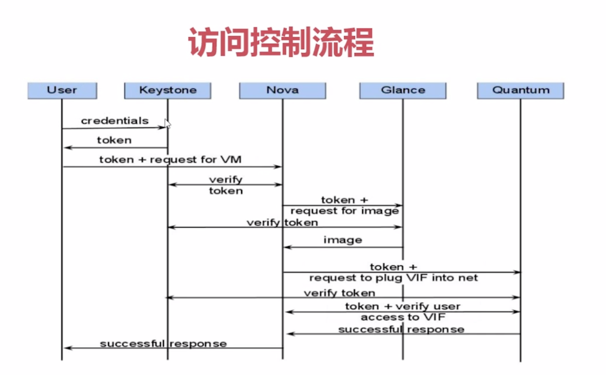

#### **一、OpenStack 5个功能模块：**
表示层（Presentation）、逻辑控制层（Logic/control）、资源层（Resources）、集成层（Integration）、管理层（Management）
##### 资源层（Resources）
* 计算资源管理模块 compute
* 存储资源管理模块 volume
* 网络资源管理模块 network
##### 逻辑控制层
掌管 OpenStack 的基础服务
* 编排服务 Orchestration
* 调度服务 Scheduling
* 策略服务 Policy
* 镜像注册服务 Images Registry
* 日志服务 Logging
##### 表示层
负责和用户打交道
* APi层
* ui 层
##### 集成层
* 计费 Billing
* 认证 Identity
##### 管理层
* 管理 api
* 监控 monitoring

----
#### **二、openstack 各个组件**
##### 1、Horizon 提供给 UI 服务
主要负责为用户提供 UI 服务，负责蒋用户的界面操作转化成对后台的 API 调度；

云管理员对整个云平台资源的调度、整合和配额管理，掌握整体的运行情况是和使用情况；
用户对自己所有资源操作、管理和调整；

##### 2、Keystone提供身份认证服务
(1) 负责身份认证和权限控制，OpenStack 所有操作都需要经过 Keystone 的控制。
租户 Tenant，一系列用户的集合，决定用户能够访问那些资源以及资源的多少。
角色Role，一组用户可以访问资源的权限
租户绝对访问多少，角色决定能够那些操作。

(2) 访问请求进行控制。
访问对象是 service。Openstack 所有服务都需要在 Keystone 的注册；
Endpoint：服务暴露出来的访问点；
Token：访问资源的令牌

(3) 提供的服务
验证用户身份；
对合法用户提供Token，并验证；
Catalog 提供注册表服务
Policy 决定用户哪些访问权限

##### 3、Nova 计算服务，负责部分调度、策略和管理
(1) 实例生命周期管理
虚拟机、docker
(2) 计算资源的管理
(3) 向外提供 Rest 风格的 API

组成模块：
- nova-api
- nova-scheduler
- nova-compute
通过消息中间件 Rabbit MQ 传递

##### 4、Glance 提供镜像服务
- 提供虚拟机镜像策存储、查询和检索服务
- 为 Nova组件提供服务
- 依赖于存储服务和数据库

##### 5、Cinder/swift 存储服务  
**swift 网络对象存储**
- 无限可扩展
- 本身提供高可用 
**ceph 块存储** 
- 管理所有的块存储设备为 vm 服务
- 本地，只能挂靠在 vm 上面使用
##### 6、Neutron 网络服务模块
为云计算环境提供虚拟机网络功能
给每个用户提供独立的网络环境
三种网络模式：
- flat 模式  手工配置网络
- flat DHCP 设定了 dhcp 辅助用户
- vlan 模式

##### 7、Heat 编排组织模块
##### 8、Ceilometer 监控计量服务

------
#### 三、核心组件的关系

